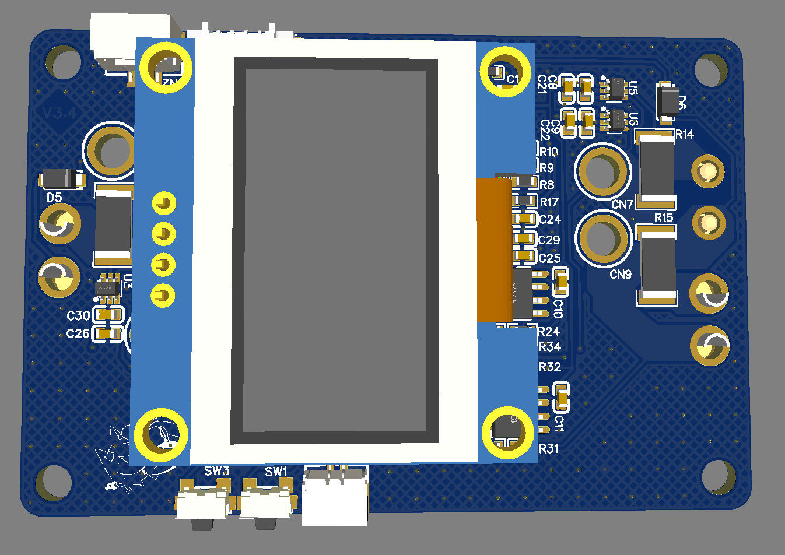
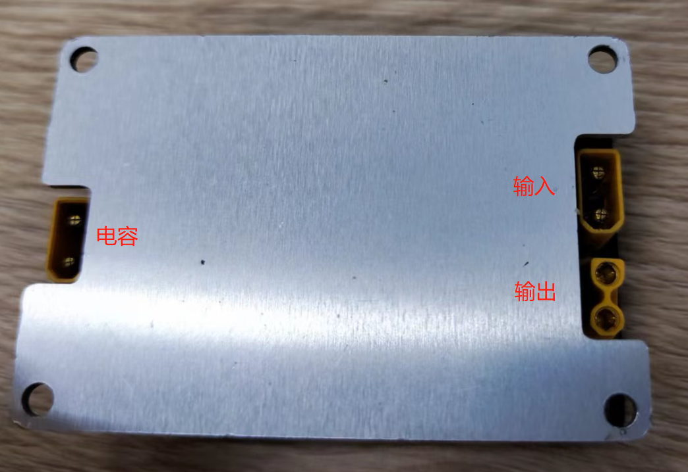
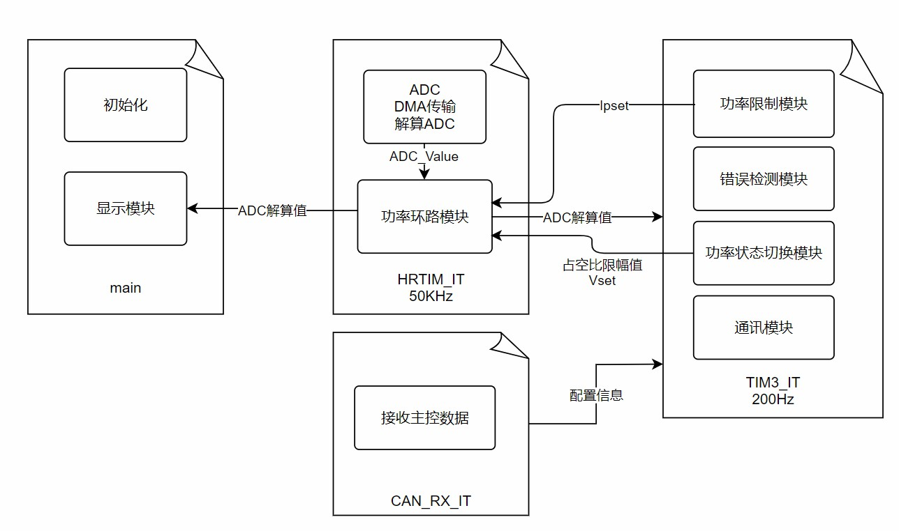

# 超级电容控制板

## 介绍
基于双向Boost-Buck的升降压电路的超级电容控制板



## 文件架构

./PCB设计 中.zip后缀为Altium导出文件，解压后可用ad打开

./PCB设计 中.eprj后缀为立创ead专业版工程文件，可以直接用专业版打开

./附件 中为封装好的无缝切换buck-boost算法，根据说明配置好后可直接使用

./参考资料 为本次项目所参照的一些资料和文档。

## 使用方法

短按上下键在电源环路显示、功率、超电内部状态将来回切换。
长按1s左右能过开启超电，接入can线后可以由can来控制运行状态。
接线图如下图所示：

## 软件部分
### 软件架构
程序部分主要分为：功率限制模块、功率环路模块、错误检测模块、功率状态切换模块、显示模块、通讯模块，由于数字电源需要很高的实时性和性能消耗，此处不宜采用RTOS。

所以我们选择了前后台的处理模式，根据各个模块的重要性来设置中断优先级，将最不重要的显示模块放在主函数的循环中；通讯模块、功率限制模块、功率状态模块、错误检测模块放在tim3的中断中，优先级为高。功率环路模块放在HRTIM的中断内且优先级最高。整体框架如下：



### 各模块详情
#### 功率环路模块
`Power_Loop()`：功率控制环路，运行频率50KHz，在HRTIM的溢出中断中调用。通过控制占空比来实现对硬件部分来进行控制，使用状态机`power_mode`来对其运行模式进行切换，根据运行模式不同可以分为back模式、boost模式和standby模式，其中standby模式为关闭功率环路，使用双闭环PI控制器，电压环作为外环，电流环作为内环。同时将功率环以最大输出电流对电压环输出进行限幅，从而起到功率限制的作用，其优点是无论如何其最大电压都能够保持稳定，不会出现过于严重的电压超调情况，缺点是运算量较大(50KHz运行频率不是闹着玩的)。

`Power_Loop_Mode()`：功率环路运行状态切换，运行频率200Hz，在TIM3中断中最后调用。该函数的目的主要是起到缓启动，使用状态机`running_status`进行区分，根据运行模式可以区分为：Init、Start、Run、Error、Wait。
 - `Init`：初始化，主要是重置PID和配置初始缓启动值。运行后即切换到`Start`。
 - `Start`：缓启动，期望电压缓慢跟随设定电压，缓慢提升占空比从而达到缓启动效果，占空比缓启动完成后即切换到`Run`。
 - `Run`：运行，期望电压缓慢跟随设定电压，以减少超调。
 - `Error`：错误，环路出现异常时候切换到该状态，在此状态会关闭HRTIM的PWM输出。
 - `Wait`：等待，啥都不干，等待可以运行，在此状态会关闭HRTIM的PWM输出。

`Power_Mode_Switch()`：功率环路运行模式切换，在切换运行模式(如buck切换至boost时)需要调用此函数，

`Power_Error_Taip()`：功率环路错误捕获，运行频率200Hz，在TIM3中断中调用。主要捕获情况是输出过压，输出过流，环路异常(如mos管击穿等)。

#### 功率限制环路
`Power_Limit_Loop()`：功率限制环路，运行频率200Hz，在TIM3中断中调用。会计算出功率，使用双闭环PI控制器，内环为功率环，使用ADC采样获得的数值起到主要功率限制的作用，能量缓冲环为外环，使用裁判系统的数据对ADC采样误差进行矫正，并且补充缓冲功率。

## 超级电容接口
在".\demo"的"SuperCup.c","SuperCup.h"为主控通讯驱动代码，需要根据自己CAN库函数来配置CAN通讯接口和发送代码的接口。
该驱动作用主要是配置发送和解算接收超级电容通讯。
可以直接读取或修改supercup来获取/设置超级电容数据。

### 驱动接口
**`SuperCapCanTxMsg`**：CAN消息结构体，例如STD库是`CanTxMsg`，HAL库是`CAN_TxHeaderTypeDef`

**`SuperCapCanTransmit(TxMassage,DataBuffer)`**：can发送函数，STD库是：`CAN_Transmit`，HAL库是：`HAL_CAN_AddTxMessage`，注意HAL库有个Tx_Mailbox参数，需要声明后传入。

**`SuperCapTimestamp`**：时间戳类型，在Free RTOS中是`portTickType`，或简单使用`uint32_t`

**`SuperCap_Get_Timestamp()`**：获取时间戳函数

**`SUPERCAP_CONNECT_TIMEOUT`**：超级电容超时时间，默认给1s
### 超级电容参数设置和读取
必须使用Set_SuperCap_PowerLimit，其他可以根据需求使用。调用了`Chassis_Power_Limit()`的话可以不使用(内部调用)。

**`Set_SuperCap_PowerLimit()`**：设置超级电容期望功率，该值通常由裁判系统的底盘限制功率。

**`Set_SuperCap_CompensationLimit()`**：设置超级电容最大补偿功率，设置为0关闭超功率补偿。

**`Set_SuperCap_ChargeLimit()`**：设置超级电容最大充电功率，设置为0关闭超级电容充电。

**`Get_SuperCap_Vcap()`**：读取电容电压，注意该值大小放大了100倍。

**`Get_SuperCap_Pchassis()`**：读取当前底盘功率，注意该值大小放大了100倍。

**`Get_SuperCap_Vchassis()`**：读取底盘电压，注意该值大小放大了100倍。

**`Get_SuperCap_Pcharge()`**：读取电容充电功率，为负为放电功率，注意该值大小放大了100倍。

**`Get_SuperCap_Status()`**：读取控制板状态标志位，具体状态见下表：
 - `CapEnable`：电容使能状态
 - `CapUndervoltage`：电容欠压
 - `PowerCompensationLimit`：电容功率补偿达到上限
 - `PowerLoopError`：电源环路异常
### 超级电容发送和接收函数
该函数必须正确使用，不然将无法正常通讯
**`Receive_SuperCap_Feedback(supercap_rxbuffer)`**：电容接收数据解算函数，在接收到CAN ID为0x030时将接收数组传入该函数。
>```c
>//file:Can.c;function:Message_buffer1
>	else if(0x030 == RxMessage->StdId) //超级电容
>	{
>		Receive_SuperCap_Feedback(RxMessage->Data);
>	}
>```
**`SuperCap_Sand_Config(*tx_message,supercup_txbuffer[8],supercap_state)`**：发送电容配置函数，在设置超级电容配置后需要调用发送
 - `*tx_message`：发送消息结构体指针
 - `supercup_txbuffer[8]`：发送数组，在STD库该参数为tx_message.Data，在HAL库需要自行定义发送数组。
 -  `supercap_state`：超级电容开关状态，该值通常为裁判系统给出的底盘输出情况或关闭。直接给ENABLE会过不了检录。
>```c
>//file:Task_Chassis.c function:Task_Chassis
>#define Chassis_Power_Output            game_robot_status_t.mains_power_chassis_output
>#if USE_CHASSIS
>			// 更新超级电容状态
>    		SuperCap_Sand_Config(&CAN_1.TxMessage, CAN_1.TxMessage.Data, Chassis_Power_Output);
>			// 发送电流值
>			CAN1_Send_Msg(&TxMessage1, Chassis.motor[Chas_LF].Current, Chassis.motor[Chas_RF].Current, Chassis.motor[Chas_LB].Current, Chassis.motor[Chas_RB].Current, Chas_ESC);
>#else
>			Chassis_Close_Output();
>#endif
>```

>```c
>//file:Task_Chassis.c
>void Chassis_Close_Output()
>{
>	CAN1_Send_Msg(&TxMessage1, 0, 0, 0, 0, Chas_ESC);
>	//关闭超级电容输出
>	SuperCap_Sand_Config(&CAN_1.TxMessage,CAN_1.TxMessage.Data,DISABLE);
>}
>```

**`SuperCup_Sand_Data(*tx_message, supercup_txbuffer[8], buffer_power)`**：发送裁判系统功率缓冲功率数据。
 - `*tx_message`：发送消息结构体指针
 - `supercup_txbuffer[8]`：发送数组，在STD库该参数为tx_message.Data，在HAL库需要自行定义发送数组。
 -  `buffer_power`：底盘缓冲功率，该值为裁判系统给出，该值放大了100倍。
>```c
>//file:Info_Update.c function:Info_Transmitter_Task
>		JUDGE_Show_Data(&pvParameters);//自定义UI用户数据上传,10Hz官方限制速度
>		SuperCup_Sand_Data(&CAN_1.TxMessage,CAN_1.TxMessage.Data,power_heat_data_t.chassis_power_buffer/100);
>		USART_SendData(USART6,CV);     //发送超级电容数据
>		vTaskDelayUntil(&currentTime, TIME_STAMP_100MS);//绝对延时
>```
## 功率限制
### 算法简介
基于裁判系统能量缓冲数据实现主要限幅，同时限制其最大电流来防止瞬间功率过大，开启超级电容时候使用一个修正函数来提高响应。
### 参数配置
**`CHASSIS_DRIVE_NUMBER`**：底盘驱动轮数量，根据底盘驱动轮来改写
**`CHASSIS_DRIVE_IMAX`**：输出最大电流

### 驱动接口
**`Chassis_Power_Value`**：底盘功率，使用裁判系统的数据：`power_heat_data_t.chassis_power`
**`Chassis_Power_Buffer_Value`**：裁判系统给出的缓冲功率：`power_heat_data_t.chassis_power_buffer`
**`Chassis_Power_Limit_Value`**：裁判系统给出的功率限制：`game_robot_status_t.chassis_power_limit`
**`Chassis_Power_Output`**：裁判系统的底盘输出开关：` game_robot_status_t.mains_power_chassis_output`
**`#define Chassis_Set_Current(i)`**：底盘输出电流值，在发送前调用：`chassis.motor[i].Current`

### 功率限制函数
**`Chassis_Power_Limit(FunctionalState *Supercap_Mode)`**：功率限制函数，在发送前底盘数值前调用。
对于发送的是非电流值而是速度值的(如关节电机)，依然可以调用此函数，此时`CHASSIS_DRIVE_IMAX`为最大速度。
注意：如果是平衡步兵，该函数需要**在速度环输出时调用**，不能影响到直立环。

 - `*Supercap_Mode`：超级电容模式，注意该值在超级电容榨干后的时候会在函数内置`DISABLE`。
