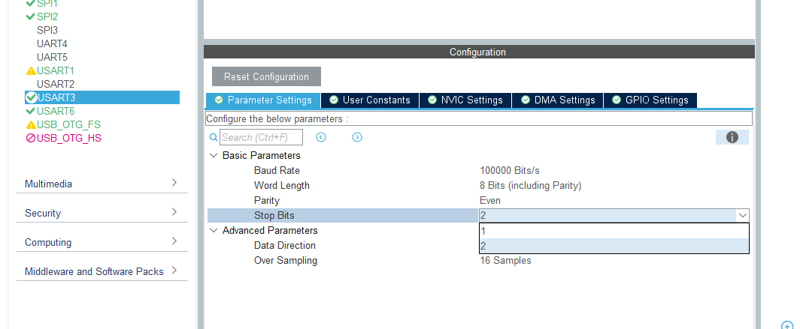

## **关于新遥控器的相关思路**
Author: BillZH/JiaHeWG

目前已经能够确定的主要内容：
1. i6x系列接收机使用SBUS解码，与DBUS电气特性相同（反相UART），如果使用现有DR16接收机的主控可以直接改接，需要在STM32CubeMX中修改对应Layout **（待验证）**

2. 已经阅读了对应代码和初步回顾C++，需要做的主要工作即为调整dji_dbus.cpp/.h及dji_remote.h三个文件，以实现暴露接口相同，最小化后续驱动影响。可能可以考虑利用现有闲置sbus.cpp完成？
3. 这套新遥控器硬件限制无法完成键盘鼠标模拟，暂无可选替代，待进一步确定。

接下来需要等待遥控器及接收机到货后找一块闲置C板/现有主控测试输出，适配即可。

Version: 2026.9.27

更新：原有开源代码的逻辑不明确，暂时先做channel适配，还在阅读现有工程的UART-解码逻辑，存在DBUS-SBUS的停止位栈协议问题，考虑时序影响？需要上机

Version: 2026.10.2

更新：找到浙江工业大学的相关开源项目，尝试引入
https://github.com/ZJUT-Deus/2027_Reserve_Infantry/blob/main/README_I6X.md

初步处理了原有的sbus.h/sbus.cpp，添加注释等待sbus裁剪协议移植

Version: 2026.10.3

更新：项目移交

目前进度为: 移入了：https://bbs.robomaster.com/article/813230?source=4 中的i6x初步开源代码（C语言实现）

移入目录：boards/drivers/src/i6x.c; boards/drivers/include/i6x.h

以及浙江工业大学开源，关于遥控器部分的readme.md：https://github.com/ZJUT-Deus/2027_Reserve_Infantry/blob/main/README_I6X.md

移入目录：boards/drivers/src/I6X-ZJUT.cpp； boards/drivers/include/I6X-ZJUT.h 

浙江工业大学的实现中把整套i6x的sbus解码从dma接收数据到解码完成通道重分配塞在同一个i6x库里，我们理论上只需要移植其中解码部分即可，但是需要考虑和现有DBUS程序的兼容性。

仍然存在鼠标键盘使用问题，需要回头看dbus关于这部分可选输出的默认处理并做null上报避免runtime error

这两部分在个人fork仓库中，push分支请务必close

我目前进度推得比较慢，主要时间浪费在理解现有生产环境，抱歉。

By BillZH/JiaHeWG

Version: 2026.10.3