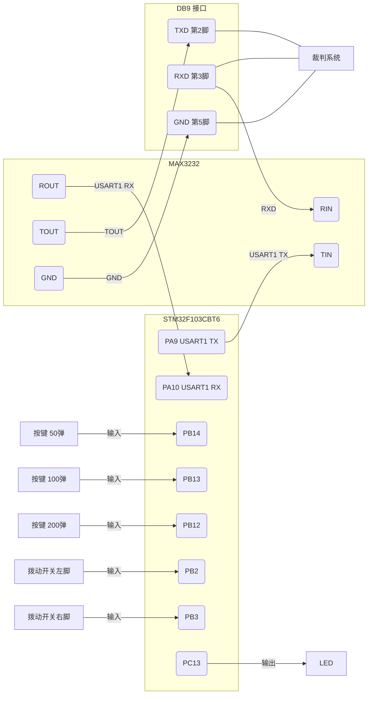

# BulletExchanger — Sarzn

> 目标板：STM32F103CBT6 - (F103_Nano_general)  

---

## 1. 项目概述 - *What*

> BulletExchanger 是一个运行在独立 F103 小板上的自动购弹控制器程序 ~
> 操作手通过桌面上的物理按键，一键完成购弹，无需手动移动鼠标点击。

### 功能 - *How*

- 三个按键分别触发购买 **50 发 / 100 发 / 200 发** 弹药
- 通过~~拨动开关~~`摇头开关`选择弹药类型：**左拨 = 17mm 小弹丸（O 键）**，**右拨 = 42mm 大弹丸（I 键）**
- LED 闪烁反馈：`1.初始化完成时快闪 3 次` `2.每次成功买弹后闪烁一次`
- 通过裁判系统串口（`0x0306 指令`）向游戏客户端发送模拟键鼠操作

### 原理 - *Why*


按下按键
- F103 通过 USART1（PA9/PA10）发送 0x0306 数据包
- RS232 电平转换（MAX3232）-> 裁判系统电管链路
- 游戏客户端自动完成：打开商城 -> 点击数量按钮 -> 确认购买


---

## 2. 关键函数说明

| function | @brief |
|------|------|
| `send_click(x, y)` | 发送一次完整鼠标点击（`移动`、`按下`、`松开`，共 3 个包，每包间隔 `CLICK_DELAY_MS`） |
| `click_OI()` | 发送 O 键或 I 键，根据拨动开关位置自动切换，用于打开/关闭购弹界面 |
| `buy_bullets(x, y, double_click)` | 完整购弹流程：`O/I 键`、`点击数量`、`确认`、`O/I 键`、`归位` |
| `RM_RTOS_Init()` | 在FreeRTOS启动前初始化外设UART、GPIO |
| `RM_RTOS_Default_Task()` | 主任务 |

---


## 3. config.h 坐标校准说明

> **!! Improtant !!**：所有坐标必须在**比赛用电脑**上校准，不能用自己的笔记本。

| 常量 | 说明 | 默认值 |
|------|------|---------|
| `POS_50_X / POS_50_Y` | 50发按钮坐标 | 1160, 560 |
| `POS_100_X / POS_100_Y` | 100发按钮坐标 | 1210, 560 |
| `POS_200_X / POS_200_Y` | 200发按钮坐标（点 100 发两次） | 1210, 560 |
| `BUY_X / BUY_Y` | 买 | 960, 670 |
| `CONFIRM_BUY_X / CONFIRM_BUY_Y` | 确认买 | 860, 560 |
| `CLICK_DELAY_MS` | 每个数据包之间间隔 | 25ms |
| `LOOP_DELAY_MS` | 主循环轮询间隔~这样也可以用来按键消抖啦!~ | 10ms |

**校准步骤**：

1. 在比赛电脑上以比赛分辨率（1920×1080）运行 RoboMaster 客户端
2. 确认 Windows 显示缩放为 **100%**（设置 → 显示 → 缩放）
3. 安装 Snipaste 或 PixPin，开启鼠标坐标显示
4. 进入游戏商城界面，悬停在各按钮上记录坐标
5. 修改 `config.h` 后重新编译烧录

---

## 4. 硬件设计说明

### 4.1 整体拓扑




### 4.2 BOM表

| 元件 | 型号/规格 | 数量 | 说明 |
|------|---------|------|------|
| 主控芯片 | STM32F103CBT6 | 1 | \ |
| 按键 | 红轴 | 3 | \ |
| 拨动开关 | 2档摇头开关 | 1 | \ |
| LED 指示灯 | 普通 LED + 限流电阻（220Ω） | 1 | 状态反馈 |
| 电平转换 | MAX3232（**必须是 3232，不能用 232**） | 1 | TTL 转 RS232，3.3V 供电 |
| 电源 | 3.7V 锂电池 + LDO 稳压至 3.3V | 1 | 建议 TP4056 充电管理模块 |
| 充电接口 | USB-C 接口 | 1 | \ |
| 连接线 | FTDI 芯片的 RS232 转 USB 线 | 1 | \ |

### 4.3 F103 引脚分配

| 功能 | 引脚 | 方向 | 配置 |
|------|------|------|------|
| 裁判系统串口 TX | PA9 (USART1_TX) | 输出 | AF 推挽，115200 波特率 |
| 裁判系统串口 RX | PA10 (USART1_RX) | 输入 | 浮空输入 |
| 按键 50弹 | PB14 | 输入 | 上拉，低电平有效 |
| 按键 100弹 | PB13 | 输入 | 上拉，低电平有效 |
| 按键 200弹 | PB12 | 输入 | 上拉，低电平有效 |
| 拨动开关左 | PB2 | 输入 | 上拉，低电平有效 |
| 拨动开关右 | PB3 | 输入 | 上拉，低电平有效 |
| LED 指示灯 | PC13 | 输出 | 推挽输出（高电平亮） |

### 4.4 MAX3232 接线

| MAX3232 引脚 | 连接目标 | 说明 |
|------------|---------|------|
| VCC | 3.3V | **必须用 3232**，原因是它支持 3.3V 供电 |
| TIN（TTL输入） | F103 PA9 | F103 串口发送 |
| ROUT（TTL输出） | F103 PA10 | F103 串口接收（本项目只发不收，可不接） |
| TOUT（RS232输出） | DB9 第 **2** 脚 (TXD) | RS232 信号输出 |
| RIN（RS232输入） | DB9 第 **3** 脚 (RXD) | RS232 信号输入 |
| GND | DB9 第 **5** 脚 (GND) | **必须共地,不然后果自己看着办吧** |
| 外围电容 | 1μF × 4 | 参考 MAX3232 数据手册典型应用电路 |

> ！ DB9 只需接 3 根线（2、3、5），其他引脚悬空。

### 4.5 按键接线方式

所有按键均使用**一端接 GPIO 引脚，另一端接 GND** 的方式。
软件配置 `GPIO_PULLUP`（内部上拉），按下时引脚拉低（低电平有效）。

### 4.6 ~~拨动开关~~摇头开关接线方式


```
公共脚 ──► GND
左档脚  ──► PB2
右档脚  ──► PB3

位置        PB2     PB3     含义
左挡        低       高      17mm 小弹丸 (O键)
中间        高       高      保持上次状态
右挡        高       低      42mm 大弹丸 (I键)
```

均配置为 `GPIO_PULLUP`。

---

## 5. Q

| 现象 | 原因 | 解决方法 |
|------|------|---------|
| 按键完全没反应 | RS232 线驱动不兼容 | 换 FTDI 芯片的线；设备管理器确认 COM 口识别 |
| 按键没反应 | 波特率不匹配 | 确认两端都是 115200 |
| 点击位置偏 | 坐标没校准 | 在比赛电脑上重新校准，确认 100% 缩放 |
---